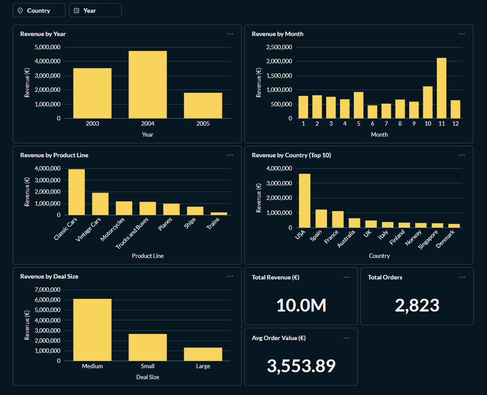
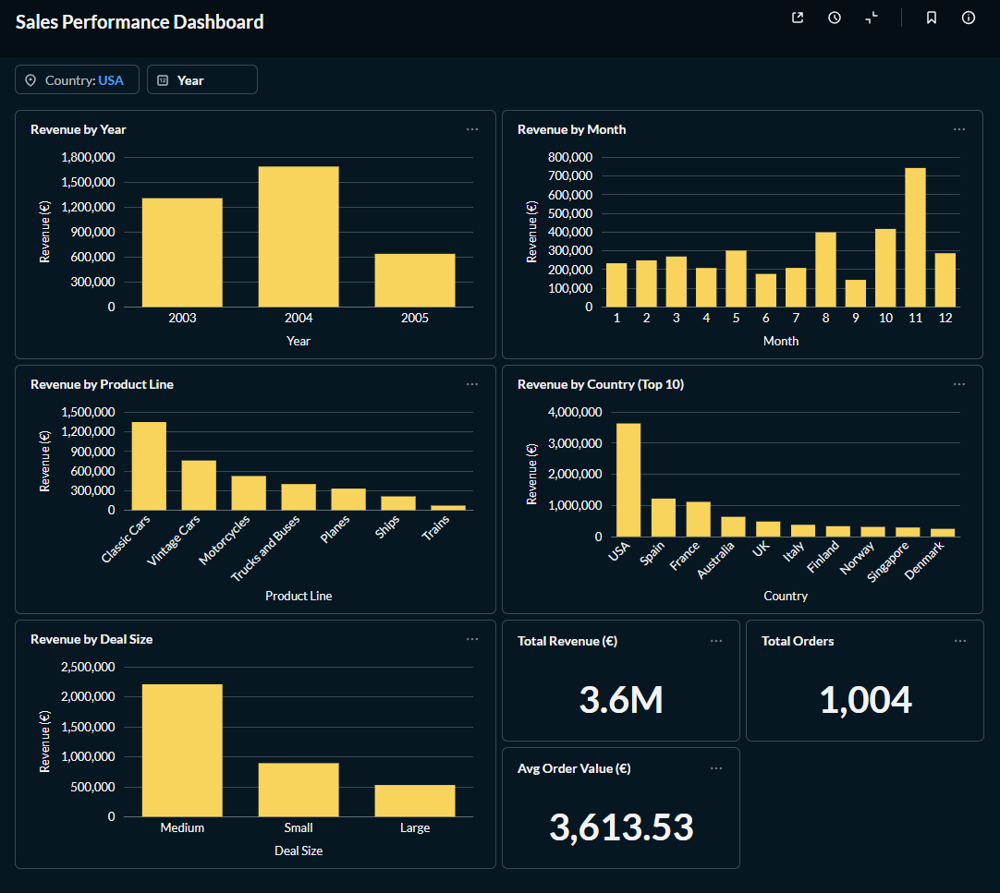
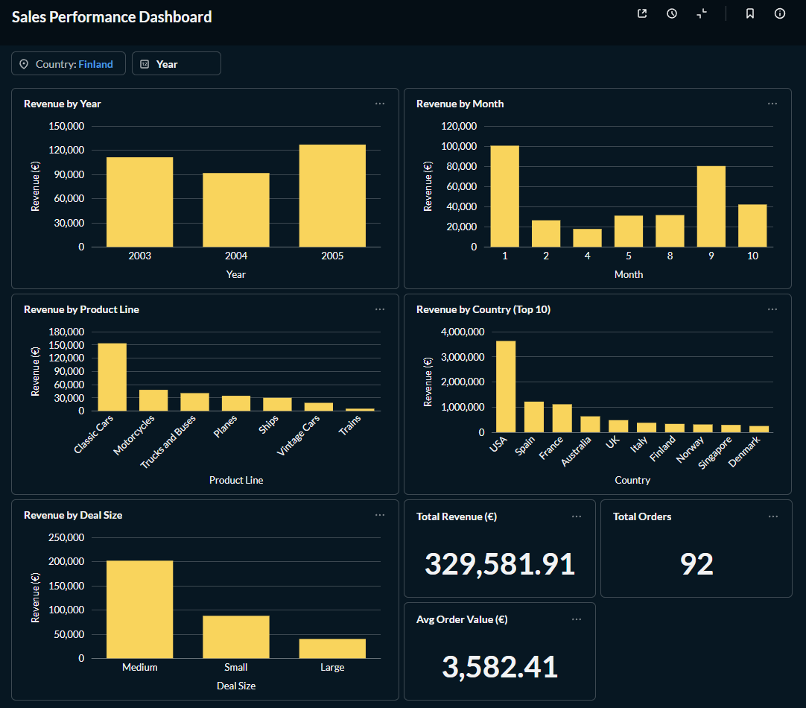

# Sales Analysis with PostgreSQL (Local)

End-to-end SQL analytics project in PostgreSQL.

## What’s inside
- `data/sales_data_sample.csv` – source dataset (2,823 rows)
- `sql/01_schema.sql` – creates schema + sets search_path
- `sql/02_create_raw_table.sql` – creates staging table
- `sql/03_load_raw.sql` – loads CSV into staging (COPY)
- `sql/04_transform_and_analysis.sql` – creates clean table + analysis queries
- `outputs/results.md` – saved query outputs (viewable without running)

## How to run (DBeaver)
1. Create database `analytics` (or use an existing DB)
2. Connect in DBeaver
3. Run scripts in this order:
   - `sql/01_schema.sql`
   - `sql/02_create_raw_table.sql`
   - `sql/03_load_raw.sql`  
     **Note:** this script uses a local file path. If your repo path is different, edit the `FROM '...'` line.
   - `sql/04_transform_and_analysis.sql`

## Notes
- CSV load uses `ENCODING 'WIN1252'` to avoid UTF-8 byte errors.
- Tables created:
  - `sales.stg_sales_raw` (staging)
  - `sales.sales_clean` (clean analytics table)

## Tools
PostgreSQL • DBeaver • SQL

## Dashboard (Metabase)

