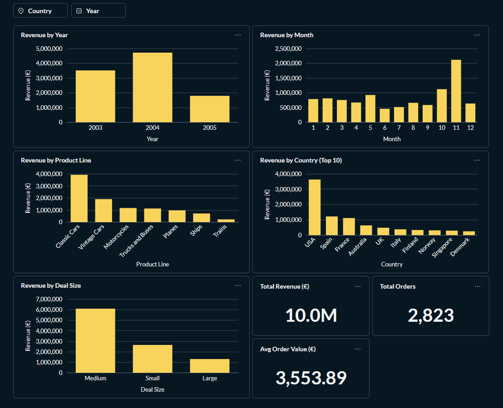
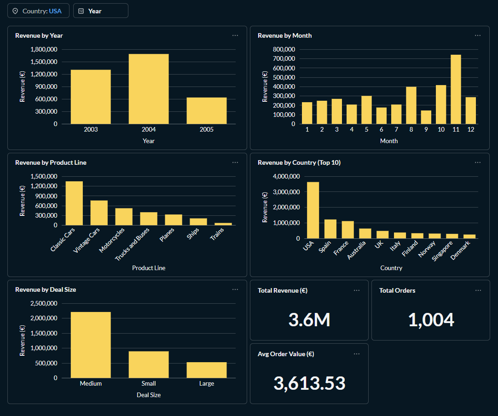
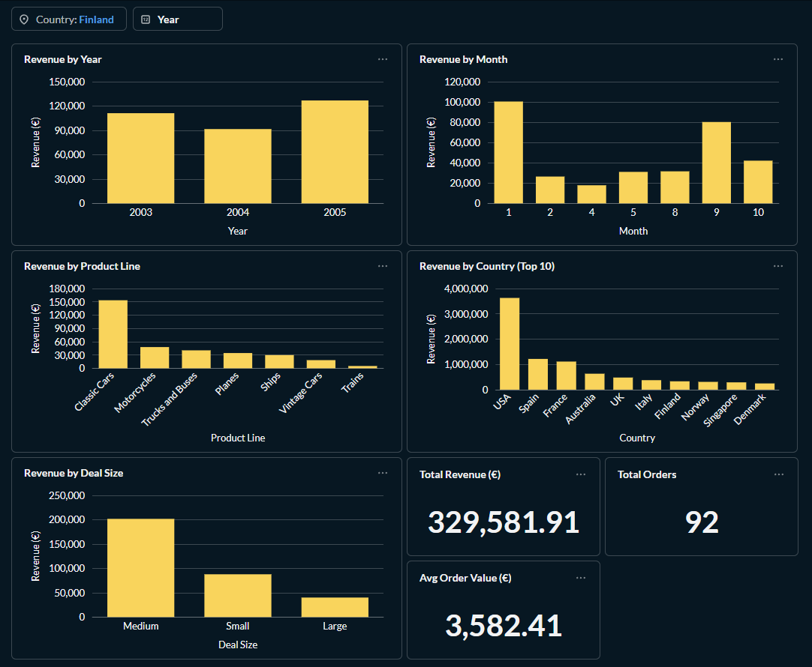
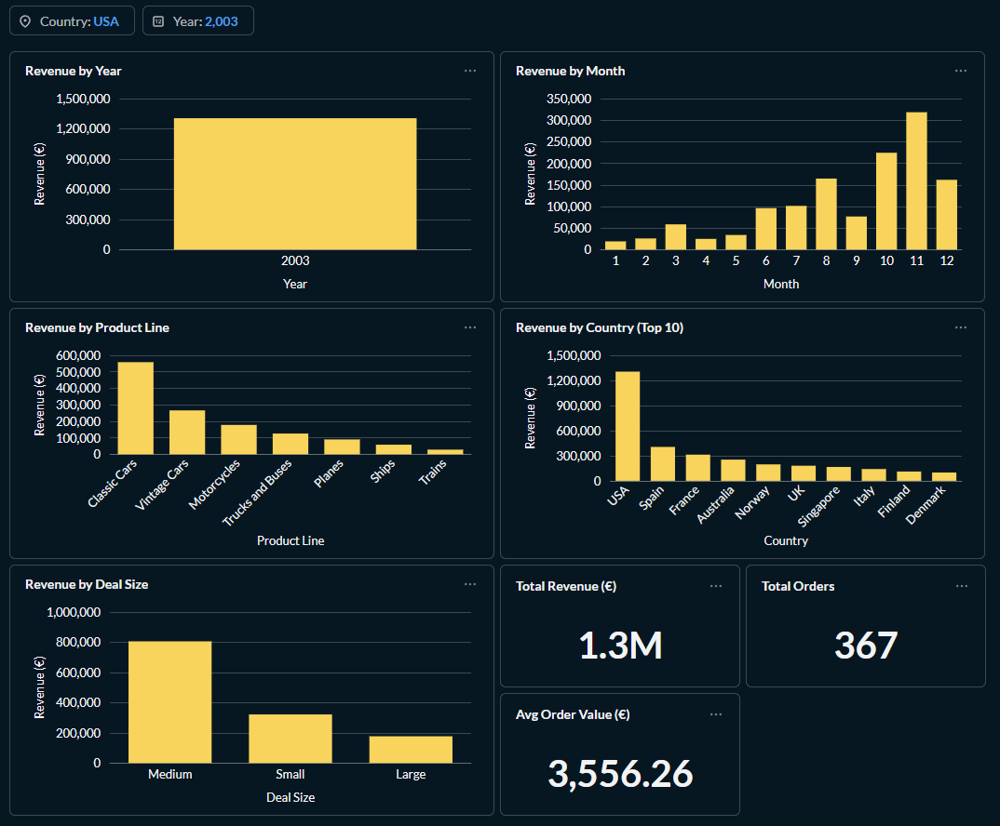

# Sales Analysis with PostgreSQL (Docker)

End-to-end SQL analytics project: raw CSV -> clean layer -> star schema -> Metabase dashboards.

## Quickstart
1. Start everything:
   ```bash
   docker compose up
   ```
2. Open Metabase: http://localhost:3001
3. In Metabase, add the warehouse database:
   - Host: `warehouse`
   - Port: `5432`
   - Database: `sales`
   - Username: `postgres`
   - Password: `postgres`

That’s it - the database is created and the CSV is loaded automatically on first start.

## What's inside
- `data/sales_raw.csv` - source dataset (2,823 rows)
- `docker-compose.yml` - Postgres warehouse + Metabase
- `docker/warehouse-init/00_bootstrap.sql` - auto-runs SQL scripts on first container start

SQL scripts (auto-run by Docker on first start):
- `sql/01_schema.sql` - creates schema + sets search_path
- `sql/02_create_raw_table.sql` - creates staging table (`sales.stg_sales_raw`)
- `sql/03_load_raw.sql` - loads CSV inside Docker (path: `/data/sales_raw.csv`)
- `sql/04_transform_and_analysis.sql` - builds clean table (`sales.sales_clean`)
- `sql/05_build_star_schema.sql` - builds star schema (dims + fact)

Read-only SQL packs (run manually):
- `sql/06_analytics_queries.sql` - advanced analysis queries (window functions, cohorts, segmentation)
- `sql/07_daily_commercial_questions.sql` - stakeholder support playbook queries (KPIs + drivers + validation)

Outputs:
- `outputs/outputs.md` - saved query outputs (viewable without running)
- `outputs/*.png` - Metabase dashboard screenshots


## Stakeholder support (commercial questions)
- `docs/support_playbook/README.md` (KPI definitions + validation steps + response template)
- `sql/07_daily_commercial_questions.sql` (ready-to-run daily question pack)
- `docs/ops/incident_example.md` (example debugging + prevention)
- `docs/skills_evidence.md` (evidence map)

## Data model (star schema)
- `sales.fct_order_lines` (grain: `ordernumber + orderlinenumber`)
- `sales.dim_date`
- `sales.dim_customers`
- `sales.dim_products`

## Notes
- CSV load uses `ENCODING 'WIN1252'` to avoid UTF-8 byte errors.

## Dashboard (Metabase)



# USA


# Finland


# USA Year 2003

